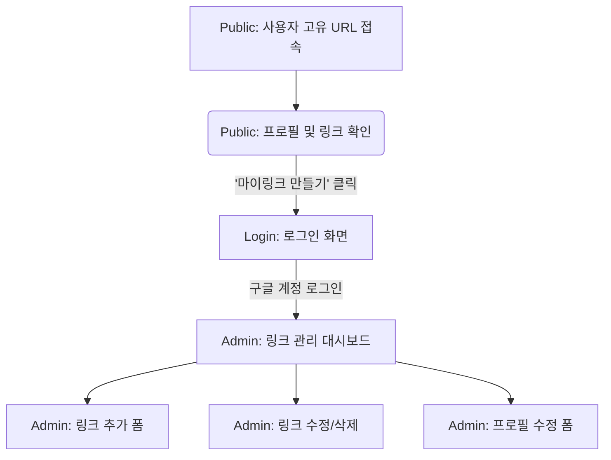

# 마이링크 (MyLink) - 와이어프레임 (Wireframe)

이 문서는 마이링크 서비스의 전체적인 화면 흐름과 각 주요 화면의 대략적인 UI 구조를 보여줍니다.

## 1. 전체 화면 흐름도 (UI Flow)



---

## 2. 주요 화면 와이어프레임 (ASCII Art)

### 2.1 로그인 화면 (Login)
- **설명**: 서비스를 처음 시작하거나 관리를 위해 접근하는 화면입니다. Firebase 기반 구글 로그인 버튼 하나로 심플하게 구성합니다.

```text
+-------------------------------------------------+
|                                                 |
|                                                 |
|                                                 |
|              [ 마이링크 로고 ]                  |
|                                                 |
|       여러분의 모든 링크를 하나로 모으세요.     |
|                                                 |
|                                                 |
|       +---------------------------------+       |
|       |  (G) Google 계정으로 계속하기   |       |
|       +---------------------------------+       |
|                                                 |
|                                                 |
+-------------------------------------------------+
```

### 2.2 관리자 대시보드 (Admin Dashboard)
- **설명**: 로그인 후 진입하는 메인 화면입니다. 상단에 프로필과 고유 URL이 있고, 하단에 링크를 관리하는 리스트가 있습니다.

```text
+-------------------------------------------------+
|  [로고]                              [로그아웃] |
+-------------------------------------------------+
|                                                 |
|  [ 내 프로필 ]                                  |
|  (사진) 닉네임: jaenk                           |
|  나의 주소: mylink.com/jaenk  [복사]            |
|                                                 |
|  +-------------------------------------------+  |
|  | [ + 새 링크 추가하기 ]                    |  |
|  +-------------------------------------------+  |
|                                                 |
|  -- 등록된 링크 리스트 -----------------------  |
|                                                 |
|  +-------------------------------------------+  |
|  | [F] 개인 블로그                    [수정] |  |
|  | https://blog.example.com           [삭제] |  |
|  +-------------------------------------------+  |
|  +-------------------------------------------+  |
|  | [F] 인스타그램                     [수정] |  |
|  | https://instagram.com/jaenk        [삭제] |  |
|  +-------------------------------------------+  |
|                                                 |
|  ※ [F]는 URL에서 자동 추출된 파비콘 이미지입니다|
+-------------------------------------------------+
```

### 2.3 링크 추가/수정 폼 (Add/Edit Form)
- **설명**: '새 링크 추가하기' 또는 '수정' 버튼을 눌렀을 때 나타나는 직관적인 입력란입니다.

```text
+-------------------------------------------------+
|  -- 링크 편집 --------------------------------  |
|                                                 |
|  제목 (Title)                                   |
|  +-------------------------------------------+  |
|  | 개인 블로그                               |  |
|  +-------------------------------------------+  |
|                                                 |
|  웹사이트 주소 (URL)                            |
|  +-------------------------------------------+  |
|  | https://blog.example.com                  |  |
|  +-------------------------------------------+  |
|                                                 |
|         [ 취 소 ]        [ 저 장 ]              |
|                                                 |
+-------------------------------------------------+
```

### 2.4 퍼블릭 페이지 (Public Viewer)
- **설명**: 방문자에게 실제로 보여지는 결과물 화면입니다. 가운데 정렬된 모바일 친화적 형태의 뷰입니다.

```text
+-------------------------------------------------+
|                                                 |
|                 ( 프로필 사진 )                 |
|                                                 |
|                   @jaenk                        |
|                                                 |
|        안녕하세요! 자유로운 개발자입니다.       |
|         포트폴리오와 SNS를 확인해 보세요.       |
|                                                 |
|                                                 |
|  +-------------------------------------------+  |
|  |  (F)  개인 블로그                         |  |
|  +-------------------------------------------+  |
|                                                 |
|  +-------------------------------------------+  |
|  |  (F)  인스타그램                          |  |
|  +-------------------------------------------+  |
|                                                 |
|                                                 |
|                                                 |
|               [ 마이링크 만들기 ]               |
|                                                 |
+-------------------------------------------------+
```
